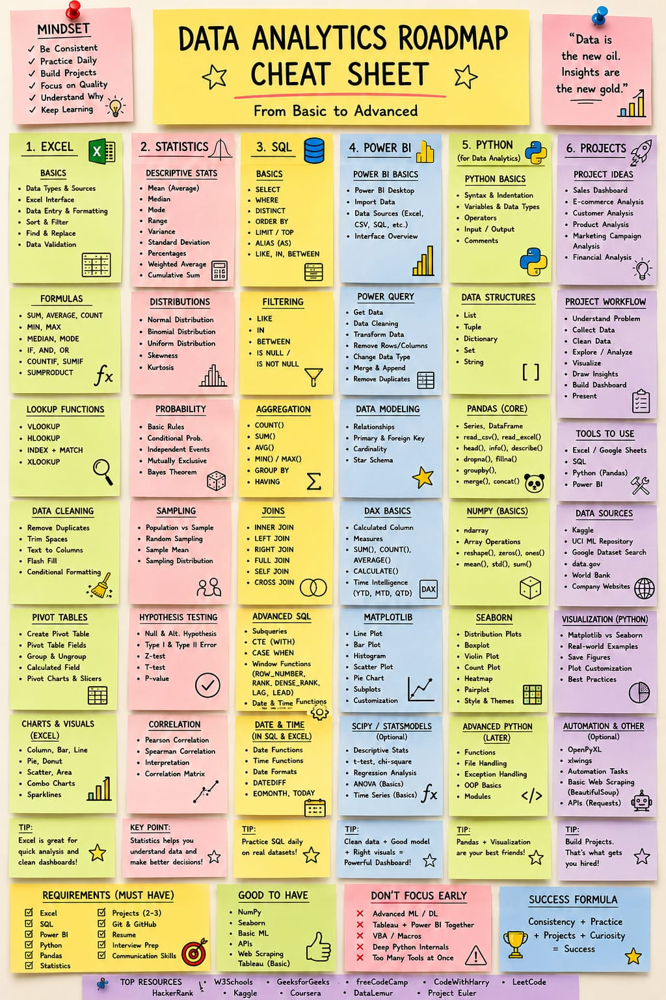

# 📊 Data Analytics Course

<p align="center">
  
</p>

<p align="center">
  <b>From Excel & Statistics to SQL, Power BI, Tableau and Python for Data Analysis</b>
</p>

---

## 🗺️ Course Roadmap

This repository contains my structured learning journey in **Data Analytics**, covering spreadsheet analysis, statistics, SQL, business intelligence, data visualization, and Python-based data analysis.

### Learning Path

```text
Excel
  ↓
Excel with AI
  ↓
Statistics
  ↓
SQL
  ↓
Power BI
  ↓
Tableau
  ↓
Python for Data Analyst
```

The roadmap is designed to build skills progressively, from data handling fundamentals to practical analysis and visualization.

---

## 📚 Course Modules

| # | Module | What It Covers |
|---|---|---|
| 1 | [📗 Excel](./1.%20Excel/) | Excel fundamentals, formulas, lookup functions, data cleaning, pivot tables, charts and dashboards |
| 2 | [🤖 Excel with AI](./2.%20Excel%20with%20AI/) | Using AI to improve Excel-based analysis, formulas, data handling and productivity |
| 3 | [📊 Statistics](./3.%20Statistics/) | Descriptive statistics, probability, distributions, sampling, hypothesis testing and correlation |
| 4 | [🗄️ SQL](./4.%20SQL(Structured_Query_Language)/) | SQL fundamentals, filtering, aggregation, joins, subqueries, CTEs, window functions and advanced SQL |
| 5 | [📈 Power BI](./5.%20Power%20BI/) | Power BI, Power Query, data modeling, DAX, relationships, measures and interactive dashboards |
| 6 | [📉 Tableau](./6.%20Tableau/) | Data visualization, dashboards and business intelligence using Tableau |
| 7 | [🐍 Python for Data Analyst](./7.%20Python%20for%20Data%20Analyst/) | Python fundamentals, NumPy, Pandas, Matplotlib, Seaborn and data analysis workflows |

---

## 🧩 1. Excel

The Excel module focuses on building a strong foundation for spreadsheet-based data analysis.

### Topics

- Excel fundamentals
- Data types and data sources
- Data entry and formatting
- Sorting and filtering
- Find & Replace
- Data validation
- Excel formulas and functions
- Lookup functions
- Data cleaning
- Conditional formatting
- Pivot Tables
- Pivot Charts
- Charts and visualizations
- Dashboard creation

### Important Functions

```text
SUM
AVERAGE
COUNT
MIN
MAX
MEDIAN
MODE
IF
AND
OR
COUNTIF
SUMIF
SUMPRODUCT
VLOOKUP
HLOOKUP
INDEX + MATCH
XLOOKUP
```

➡️ **[Open Excel Module](./1.%20Excel/)**

---

## 🤖 2. Excel with AI

This module focuses on combining Excel with modern AI capabilities to make data analysis and spreadsheet workflows more efficient.

### Focus Areas

- AI-assisted Excel workflows
- Formula generation
- Formula explanation
- Data analysis assistance
- Data cleaning assistance
- Generating insights
- Working with AI for productivity
- Using AI to understand datasets

➡️ **[Open Excel with AI Module](./2.%20Excel%20with%20AI/)**

---

## 📊 3. Statistics

Statistics provides the mathematical foundation required to understand datasets and make data-driven decisions.

### Topics

#### Descriptive Statistics
- Mean
- Median
- Mode
- Range
- Variance
- Standard Deviation
- Percentages
- Weighted Average
- Cumulative Sum

#### Probability
- Basic probability rules
- Conditional probability
- Independent events
- Mutually exclusive events
- Bayes' Theorem

#### Distributions
- Normal Distribution
- Binomial Distribution
- Uniform Distribution
- Skewness
- Kurtosis

#### Sampling
- Population vs Sample
- Random Sampling
- Sample Mean
- Sampling Distribution

#### Hypothesis Testing
- Null and Alternative Hypothesis
- Type I and Type II Errors
- Z-test
- T-test
- P-value

#### Correlation
- Pearson Correlation
- Spearman Correlation
- Correlation Matrix
- Interpretation of Correlation

➡️ **[Open Statistics Module](./3.%20Statistics/)**

---

## 🗄️ 4. SQL (Structured Query Language)

SQL is used to retrieve, transform and analyze data stored in relational databases.

### SQL Fundamentals

- SELECT
- WHERE
- DISTINCT
- ORDER BY
- LIMIT / TOP
- ALIAS
- LIKE
- IN
- BETWEEN
- IS NULL
- IS NOT NULL

### Aggregation

- COUNT()
- SUM()
- AVG()
- MIN()
- MAX()
- GROUP BY
- HAVING

### Joins

- INNER JOIN
- LEFT JOIN
- RIGHT JOIN
- FULL JOIN
- SELF JOIN
- CROSS JOIN

### Advanced SQL

- Subqueries
- CTEs / WITH
- CASE WHEN
- Window Functions
- ROW_NUMBER()
- RANK()
- DENSE_RANK()
- LAG()
- LEAD()
- Date & Time Functions

➡️ **[Open SQL Module](./4.%20SQL(Structured_Query_Language)/)**

---

## 📈 5. Power BI

Power BI is used to transform data into interactive business intelligence dashboards and reports.

### Power BI Fundamentals

- Power BI interface
- Importing data
- Data sources
- Excel / CSV / SQL data
- Power Query
- Data cleaning
- Data transformation
- Removing rows and columns
- Changing data types
- Merge & Append
- Removing duplicates

### Data Modeling

- Relationships
- Primary & Foreign Keys
- Cardinality
- Star Schema

### DAX

- Calculated Columns
- Measures
- SUM()
- COUNT()
- AVERAGE()
- CALCULATE()
- Time Intelligence
- YTD
- MTD
- QTD

### Visualization

- Charts
- Tables
- Cards
- Slicers
- KPIs
- Interactive dashboards

➡️ **[Open Power BI Module](./5.%20Power%20BI/)**

---

## 📉 6. Tableau

Tableau focuses on interactive data visualization and dashboard development.

### Focus Areas

- Tableau fundamentals
- Connecting datasets
- Data preparation
- Charts and visualizations
- Filters
- Calculations
- Interactive dashboards
- Data storytelling
- Business insights

➡️ **[Open Tableau Module](./6.%20Tableau/)**

---

## 🐍 7. Python for Data Analyst

Python is used for programmatic data analysis, cleaning, exploration and visualization.

### Python Fundamentals

- Syntax and indentation
- Variables
- Data types
- Operators
- Input / Output
- Comments
- Lists
- Tuples
- Dictionaries
- Sets
- Strings
- Functions
- File handling
- Exception handling
- Modules

### 🐼 Pandas

- Series
- DataFrame
- `read_csv()`
- `read_excel()`
- `head()`
- `info()`
- `describe()`
- `dropna()`
- `fillna()`
- `groupby()`
- `merge()`
- `concat()`

### 🔢 NumPy

- ndarray
- Array operations
- `reshape()`
- `zeros()`
- `ones()`
- `mean()`
- `std()`
- `sum()`

### 📊 Matplotlib

- Line plots
- Bar plots
- Histograms
- Scatter plots
- Pie charts
- Subplots
- Plot customization

### 🎨 Seaborn

- Distribution plots
- Box plots
- Violin plots
- Count plots
- Heatmaps
- Pairplots
- Styling and themes

### 🔬 Additional Python Analytics

- SciPy basics
- Statsmodels basics
- Descriptive statistics
- T-tests
- Chi-square tests
- Regression analysis
- ANOVA
- Time-series basics

➡️ **[Open Python for Data Analyst Module](./7.%20Python%20for%20Data%20Analyst/)**

---

## 🛠️ Tools & Technologies

| Category | Tools |
|---|---|
| Spreadsheet Analysis | Microsoft Excel |
| AI Productivity | AI + Excel |
| Statistics | Statistical Analysis |
| Database Querying | SQL |
| Business Intelligence | Power BI |
| Data Visualization | Tableau |
| Programming | Python |
| Data Manipulation | Pandas |
| Numerical Computing | NumPy |
| Visualization | Matplotlib, Seaborn |
| Version Control | Git & GitHub |

---

## 🔄 Data Analytics Workflow

The skills in this course can be combined into a complete analytics workflow:

```text
              📌 Business Problem
                      ↓
                📥 Collect Data
                      ↓
                🧹 Clean Data
                      ↓
              🔄 Transform Data
                      ↓
              🔍 Explore Data
                      ↓
              📊 Analyze Data
                      ↓
             📈 Visualize Data
                      ↓
             💡 Generate Insights
                      ↓
             📋 Build Dashboard
                      ↓
             🎯 Present Findings
```

---

## 🎯 Learning Objectives

After completing this learning path, I aim to be able to:

- Work confidently with Excel for data analysis
- Apply statistics to real-world datasets
- Write SQL queries for data extraction and analysis
- Clean and transform datasets
- Perform exploratory data analysis
- Build interactive Power BI dashboards
- Create visualizations using Tableau
- Analyze datasets using Python, Pandas and NumPy
- Create visualizations using Matplotlib and Seaborn
- Extract meaningful insights from data
- Present analytical findings clearly

---

## 📂 Repository Structure

```text
Data_Analytics_Course/
│
├── 1. Excel/
│
├── 2. Excel with AI/
│
├── 3. Statistics/
│
├── 4. SQL(Structured_Query_Language)/
│
├── 5. Power BI/
│
├── 6. Tableau/
│
├── 7. Python for Data Analyst/
│
├── Assets/
│
├── Data_Analytics_Roadmap.jpeg
│
└── README.md
```

---

## 📌 Recommended Practice

To get the most from this course:

```text
Learn
  ↓
Practice
  ↓
Analyze Real Datasets
  ↓
Build Dashboards
  ↓
Create Projects
  ↓
Document Your Work
  ↓
Build Portfolio
```

Useful datasets can be explored from platforms such as Kaggle, UCI Machine Learning Repository, Google Dataset Search and government/open-data portals.

---

## 🚀 Goal

The goal of this repository is to document my journey of developing practical **Data Analytics skills**, from fundamental spreadsheet analysis to SQL, Business Intelligence, visualization and Python-based analytics.

> **Learn → Practice → Analyze → Visualize → Build → Improve**

---

<p align="center">
  <b>📊 Data Analytics Journey</b><br>
  Building skills through consistent learning and practical work.
</p>
